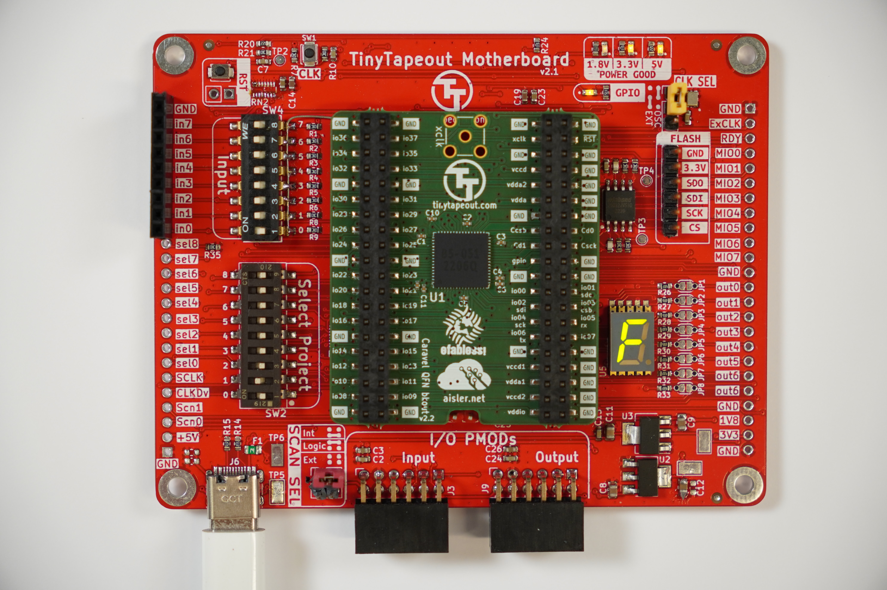

# TinyTapeout Demo Board for chips TT01, TT02 & TT03 

[TinyTapeout](https://tinytapeout.com/) is an educational project that makes it easier and cheaper than ever to get your digital designs manufactured on a real chip!

# PCB

[More photos](https://photos.google.com/share/AF1QipMfPNW5h1ToMmdxPiXkDxMh_URZRe7d-SqbOogF8Wc6BN0UmT55_Mc50GN2rfgwhA?key=SkdnNWthTFJkWDJILVlxbmpqblBqY0g4dThWaU1B)

# Setup

Select the design you want to load. See here for all the designs:

* https://tinytapeout.com/runs/tt01/
* https://tinytapeout.com/runs/tt02/
* https://tinytapeout.com/runs/tt03/

Plug in the power via USBC and the design should be active. See the documentation for the design for how to test.
If there are no docs, open an issue on the design's repo!

## Clock divider

To slow down the generated clock:

https://github.com/TinyTapeout/tinytapeout-02/blob/tt02/INFO.md#clock-divider

## Firmware

You shouldn't need to update the firmware in most cases.

If you need firmware for external scan controller you can get the firmware from here:

https://github.com/TinyTapeout/tinytapeout-02/tree/tt02/verilog/dv/scan_controller_ext

Compile and flash using the Makefile.

## We are very happy to be sponsored by

* [Efabless](https://efabless.com/)

## Features

* Lots of testpoints, big ground pads
* Expose useful signals from ASIC:
  * ready - the sync pulse when the chain is updated
  * slow clock
  * the safety scan chain pins (all those starting with ext_scan...)
  * Expose flash programming on a standard cheap footprint for some common USB FTDI programmer
* Lots of explanatory silkscreen
* Board version and link to this repo on the silkscreen
* USB C PSU, 3.3v and 1.8v
* Adjustable clock / single step
* 9 DIP switch for design select (or jumpers)
* 8 DIP switch for inputs - should last for some fiddling but don’t need to be too heavy duty - could be buttons.
* 8 LEDs for outputs: 7 segment display inc dot
* Include PMOD headers for IOs
* Pluggable into breadboard
* Flash for firmware used to setup GPIO
* Work for TT01, TT02 & TT03
* Design for test - single sided probe test points, mounting / alignment holes

## Flashing

[See the firmware repo here](https://github.com/TinyTapeout/tt123-demo-fw)

## CHANGELOG

See [CHANGELOG.md](CHANGELOG.md)

## Resources

* [Technical info on the chip, pinout, scanchain](https://github.com/TinyTapeout/tinytapeout-02/blob/tt02/INFO.md)
* [Breakout PCB](https://github.com/TinyTapeout/caravel-breakout-pcb)
* [Datasheet on Caravel: the padring and management core](https://caravel-harness.readthedocs.io/en/latest)
* Logo created at [oshwmark by CapableRobot](http://oshwmark.capablerobot.com/)

## License

* The PCB is licensed under the [Apache2 License](LICENSE)
* The documentation is licensed under the [CC0 License](CC0_license)

## Open Source Hardware

[ES000040](https://certification.oshwa.org/es000040.html)
